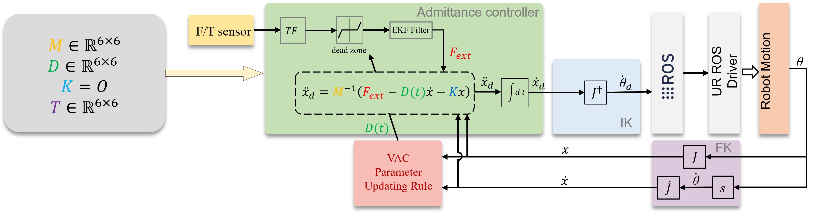

# Robot Control Guidance
## Info
This is real UR10e robot control coding part. The current code still needed to be improved. <br>
In previous commits I tried to add several new functions like [dynamic_reconfigure](http://wiki.ros.org/dynamic_reconfigure) but did not success. Please optimize the code according to your need.
## Environment
Ubuntu 20.04 + ROS Noetic

## Setting
0. Subnet mask: `255.255.255.0`; Default gateway: `192.168.1.1`
1. Ubuntu IP: `192.168.1.101`
2. UR Robot IP:  `192.168.1.102`; 
3. Windows IP (if applicable to connect with VR): `192.168.1.103`
## Usage in Real Experiment
0. Make sure you installed [ROS Noetic](http://wiki.ros.org/noetic/Installation/Ubuntu)
1. Insatall dependencies
```bash
sudo chmod +x install_dependencies.sh
```
```bash
./install_dependencies.sh
```
```bash
rosdep install -i --from-path src --rosdistro noetic --ignore-src -r -y
```
2. Compile
```bash
catkin build
```
3. Source
```bash
source ~/${workspace_name}/devel/setup.bash
```
4. Bringup: 
```bash
roslaunch ur_robot_driver otalab_ur10e_bringup.launch
```
5. Launch the `external_control` on the UR robot panel.

6. Run admittance control:
```bash
roslaunch Admittance Admittance.launch
```
7. Launch the bridge
```bash
roslaunch rosbridge_server rosbridge_websocket.launch
```
8. Publish ROS message to Unity
```bash
rosrun cartesian_velocity_controller sub
```
## Caution
Before running, please understand the code first.

Before Step 6 of running the algorithm, please scale down the robot velocity on the panel for safety reasons. Only scale to 100% velocity after securing the algorithm works as expected. 

**Be sure to hold the panel and have the Emergency Stop button available to press at all times.**

## Cartesian Velocity Controller


## Parameters
Admittance control parameters: `/control_algorithm/Admittance/config/AdmittanceParams.yaml`

VAC parameters: `/control_algorithm/Admittance/src/Admittance.cpp`

Set base height, etc.: `/universal_robot_control/cartesian_velocity_controller/src/sub.cpp`


## Reference
* https://github.com/MingshanHe/Compliant-Control-and-Application
