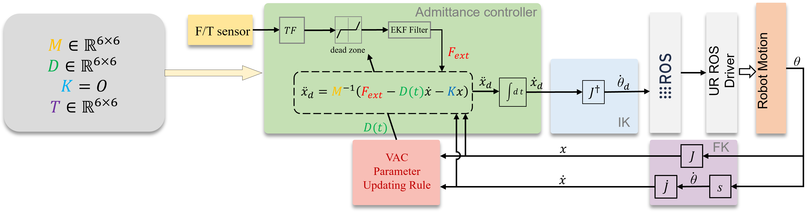

# Robot Control Guidance
## Info
This is real UR10e robot control coding part. The current code still needed to be improved. <br>
In previous commits I tried to add several new functions like [dynamic_reconfigure](http://wiki.ros.org/dynamic_reconfigure) but did not success. Please optimize the code according to your need.
## Environment
Ubuntu 20.04 + ROS Noetic

## Setting
0. Subnet mask: `255.255.255.0`; Default gateway: `192.168.1.1`
1. Ubuntu IP: `192.168.1.101`
2. UR Robot IP:  `192.168.1.102`; 
3. Windows IP (if applicable to connect with VR): `192.168.1.103`
## Usage in Real Experiment
0. Make sure you installed [ROS Noetic](http://wiki.ros.org/noetic/Installation/Ubuntu)
1. Insatall dependencies
```bash
sudo chmod +x install_dependencies.sh
```
```bash
./install_dependencies.sh
```
```bash
rosdep install -i --from-path src --rosdistro noetic --ignore-src -r -y
```
2. Compile
```bash
catkin build
```
3. Source
```bash
source ~/${workspace_name}/devel/setup.bash
```
4. Bringup: 
```bash
roslaunch ur_robot_driver otalab_ur10e_bringup.launch
```
5. Launch the `external_control` on the UR robot panel.

6. Run admittance control:
```bash
roslaunch Admittance Admittance.launch
```
7. Launch the bridge
```bash
roslaunch rosbridge_server rosbridge_websocket.launch
```
8. Publish ROS message to Unity
```bash
rosrun cartesian_velocity_controller sub
```
## Caution
Before running, please understand the code first.

Before Step 6 of running the algorithm, please scale down the robot velocity on the panel for safety reasons. Only scale to 100% velocity after securing the algorithm works as expected. 

**Be sure to hold the panel and have the Emergency Stop button available to press at all times.**

## Diagnostics
The admittance node publishes one `admittance_msgs/AdmittanceDiag` sample per
control cycle on `/admittance_diag`, and prints a one line summary to the
terminal twice a second. Rates, history length and output directory are set
under `diag:` in `AdmittanceParams.yaml`.

Whenever the robot leaves `NORMAL` safety mode, the seconds around the event are
written to `~/admittance_logs/<timestamp>_<reason>.csv` (5 s before, 2 s after by
default), so a protective stop can be inspected after the fact. Press `d` in the
node terminal to dump the same window by hand.

```bash
rostopic echo /admittance_diag          # live values
rosrun plotjuggler plotjuggler          # plot the CSV or the topic
```

The columns that matter most for protective stops are `err_lin` (how far the arm
is falling behind its velocity command), `sigma_min` (distance to a singularity),
`eff0..eff5` (joint motor currents in A, verified identical to the UR's own
`Actual current jN`) and `fe_*` versus `fu_*` (how much of the driving
force is synthetic rather than applied by the operator).

### Behaviour priority
The injected behaviours are the phenomenon the simulator exists to show, so
their commanded motion has to follow from their own parameters rather than from
how hard the operator happens to be holding the waist. Three things were taking
it away from them: the contact gate multiplies the whole command by a function
of the operator's force, the tracking compliance relaxes the command toward a
waist that is being held still, and the acceleration clamp scaled the operator
response and the behaviour down together.

Knee buckling asks for 3.69 m/s^2 against an `arm_max_acc` of 2.0, so it has
been coming out at 54 % of its parameters all along; back arching and the
sideways lean at 72 and 73 %. While a behaviour runs, `behavior_priority` holds
the contact gate open, switches the tracking compliance off, and spends the
budget on the behaviour before the operator response, with `max_acc` and
`max_vel` sized from `BehaviorParams.yaml` to cover every behaviour.

The behaviours are also integrated in the frame their parameters are written
in. They are specified in the end effector frame, but the admittance ran them
through a mass that is 10 kg laterally against 68.37 kg vertically in the base
frame, so any tilt of the effector leaked the vertical force onto an axis 6.8
times lighter. Measured across tilts of 0, 20 and 40 degrees, the acceleration
knee buckling demanded went 3.69, 9.68 and 15.69 m/s^2 -- a 4.3-fold spread on
one key press, and at 40 degrees it was clipped to 38 % of its own demand. In
the end effector frame it is 3.69 at every tilt and nothing clips it, so one key
press is one motion wherever the arm happens to be. Set `body_frame` to `false`
for the old base-frame integration.

What the body frame changes is only which mass divides the wrench. The
behaviour still enters the dynamics as an acceleration and passes through the
same integrator and the same limiters as everything else; a behaviour velocity
added to the command directly would be re-injected every cycle, wind up against
the velocity limit and drive the arm through whatever the operator did.

`max_acc` has to be the figure the slew limiter uses, because that stage runs
last and is therefore the real acceleration limit -- granting a behaviour a
budget earlier in the chain achieves nothing if the slew limiter hands it back
the operator's. With the posture leak gone the largest nominal demand is knee
buckling at 3.69 m/s^2, so 4.0 covers every behaviour and there is no reason to
go higher: headroom there is only a faster commanded acceleration, which is
what a `C153` path-deviation stop fires on.

With the arm reported held still and the operator pushing back, knee buckling
commands -0.068 m/s with this off and -0.647 m/s with it on, the same figure
whether the operator pushes 0 N or 90 N. Set `enabled` to `false` to go back to
sharing everything with the operator. The console shows `beh_pri=1` while a
behaviour is being served and `a_beh` is what it asked for, so a value above
`max_acc` means its motion is still coming out smaller than its parameters.

### Shoulder torque budget
A `C157A1` protective stop is the UR refusing torque at the shoulder lift joint
that its dynamic model cannot account for, and every newton the operator applies
is unaccounted for by definition. Seven recorded stops span 70-138 N of operator
force and 0.75-1.12 m of reach, yet all of them land at 83 +/- 4 Nm of 50 ms
filtered `|J^T w|` at joint 1. Force alone does not predict a stop; force times
moment arm does.

The node computes that torque every cycle and shows it as `tau<j>=<now>/<limit>`
on the console, so how close the arm is to a stop is visible while working.
`max=j<n>:<value>` next to it is the worst joint, whichever that is: the budget
watches joint 1 because that is what a `C157A1` trips on, but a runaway on
2026-10-08 loaded joint 0 to 105.8 Nm while the console read 30.8. The
`tau0..tau5`, `tau_f`, `tau_max`, `tau_max_j` and `tau_arm` CSV columns record
it.

The vertical force compensation is bounded by the same budget. It grows with the
square of the distance from the workspace centre while the moment arm grows with
that same distance, so its torque cost grows roughly with the cube of it: at the
edge it asks for 96 N, which at 1.12 m of reach is 107 Nm of joint torque before
the operator has done anything else. `torque_budget/vfc_budget` caps its share,
leaving the sag near the centre untouched and rolling it off only out at the
periphery. Raise it for a stronger peripheral sag, or set
`torque_budget/enabled` to `false` for the old uncapped force.

That cap alone is not enough, because the sag has no damping of its own: the
only thing that stops it is the operator's real force, and real force is what
trips the arm. On 2026-09-18 the effector sank at 0.12 m/s untouched, and
arresting it took an 81 N push -- 40 Nm of sag plus 40 Nm of the operator
fighting it, which is the whole budget. So the sag now yields to being pushed
back, over `vfc_yield_force` newtons, fast on the way down and slow on the way
back so it cannot chatter. While nobody resists it the sag is exactly as strong
as before; replaying that stop, the peak torque falls from 82 to 54 Nm with the
unopposed sag unchanged. `vfc_yield` in the CSV and `y=` on the console show how
much of it is currently released; set `vfc_yield_force` to 0 to turn it off.

### Moving the chair
The sag is measured from `vfc_center`, the seat position in `base_link`, and
grows with the square of the distance from it. **Move that parameter whenever
the chair moves.** Left behind, the simulator reads the patient as displaced
from their seat and sags harder: moving the chair 0.2 m closer without it takes
the raw sag from 121 N to 171 N, cancelling the shorter reach that moving it was
meant to buy. The node prints the seat it is using at startup.

Reach is worth moving for, because joint 1 torque is force times moment arm and
the arm is essentially the horizontal distance from the base. Working at
y = -0.85 puts it at 1.0 m, where the measured stops happen; y = -0.65 brings it
to 0.84 m and scales the same motion down to about 60 Nm. `workspace_limits`
allows y up to -0.60.

### Tracking compliance
When the arm falls behind its velocity command the operator is holding it back,
and pushing the command further only builds up joint torque until the UR trips a
`C157` collision-torque stop. The node therefore eases the command back toward
the velocity the arm is actually reaching, ramping in between `err_lin_low` and
`err_lin_high` (and the angular pair) under `tracking:` in
`AdmittanceParams.yaml`. The thresholds sit above the largest error seen during
normal manipulation, so the gain stays at 0 until the arm is genuinely stuck.

`trk=<lin>/<ang>` in the console line and the `trk_g_lin` / `trk_g_ang` CSV
columns show the ramp; `err_lin_f` / `err_ang_f` are the filtered errors driving
it. Set `tracking/enabled` to `false` to compare against the old behaviour.

While the robot is outside `NORMAL` safety mode the admittance integrator is
held at zero, so the arm does not resume at the pre-stop velocity when the
protective stop is released.

## Cartesian Velocity Controller


## Parameters
Admittance control parameters: `/control_algorithm/Admittance/config/AdmittanceParams.yaml`

VAC parameters: `/control_algorithm/Admittance/src/Admittance.cpp`

Set base height, etc.: `/universal_robot_control/cartesian_velocity_controller/src/sub.cpp`


## Reference
* https://github.com/MingshanHe/Compliant-Control-and-Application
